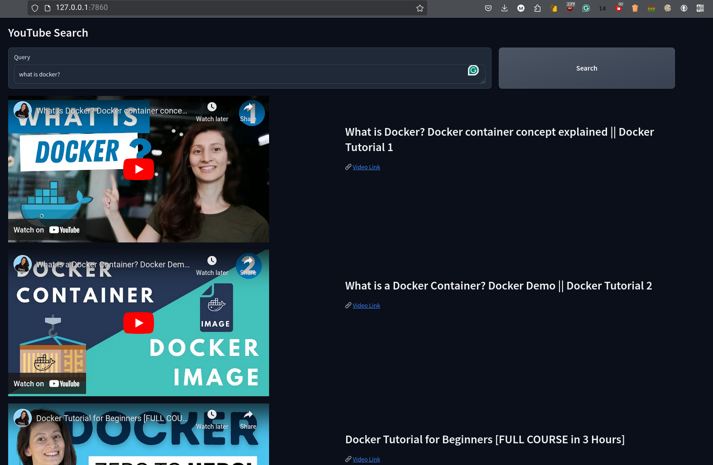

# A YouTube search approach in a specific category
In this repository, as I started to learn Docker, I tried to build a search method in TechWorld with Nana's YouTube channel. 
## Result
 

## Steps
**1.** Get all video Id's \
**2.** Filtering videos base on **Docker** topic, and Extracting its transcript \
**3.** Embedding texts with the Sbert pre-trained model [(all-MiniLM-L6-v2)](https://sbert.net/docs/sentence_transformer/pretrained_models.html#)\
**4.** Find the best video to texts and transcripts based on the input query

## Running the Docker Image from Docker Hub

You can easily pull and run this Docker image from Docker Hub using the following steps:

### 1. Pull the Docker Image

To pull the image, use the following command:

```bash
docker pull bravomahdi/yt-docker-search:latest
```

### 2. Run the Docker Image

```bash
docker run -d -p 80:80 yt-docker-search
```

### 3. Docker Hub Repository
You can find the Docker image for this project on Docker Hub:

[](https://hub.docker.com/r/bravomahdi/yt-docker-search/tags)
